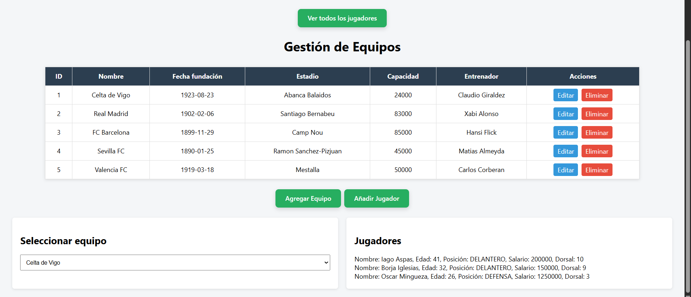
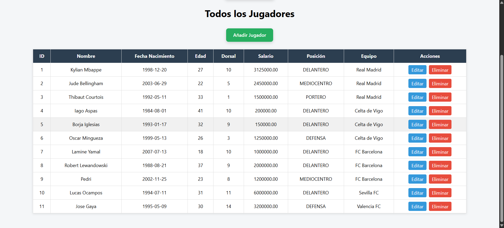
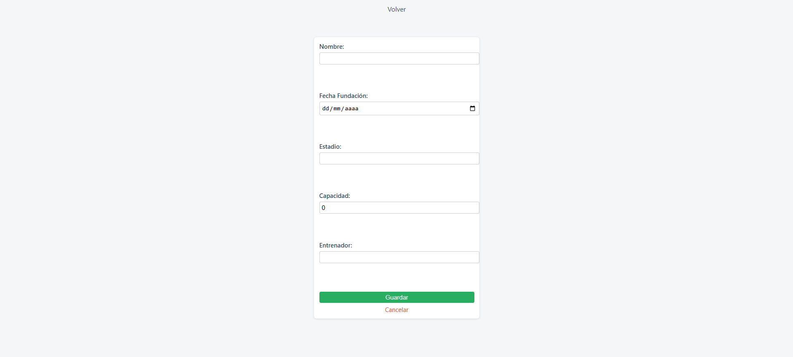
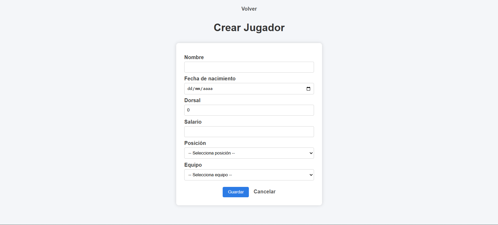

# API REST CON INTERFAZ GRÁFICA

Proyecto de gestión de equipos y jugadores de la liga española, en esta API puedes hacer las operaciones CRUD con una interfaz gráfica simple e intuitiva

## Funcionalidades
- Crear, editar y listar tanto jugadores como equipos.
- Si se borra un equipo se borrarán sus jugadores.
- Para mayor protección se trabaja con DTOs en vez de entidades.
- Excepciones personalizadas.
- Filtrado de jugadores por equipos.

## Tecnologías
- Spring Boot
- Plantilla de Thymeleaf
- HTML
- CSS
- Javascript

La API funciona con una base de datos en Sql server

Contacto: https://www.linkedin.com/in/javier-mart%C3%ADnez-p%C3%A9rez-7843451a4/

